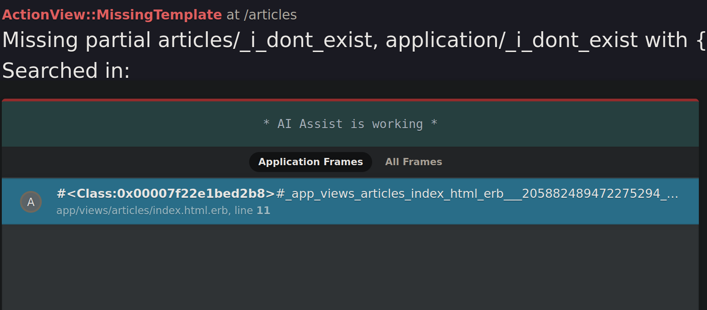
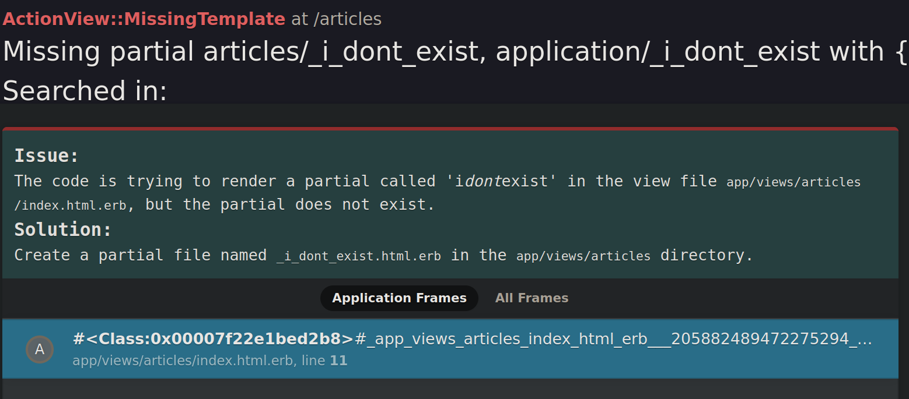
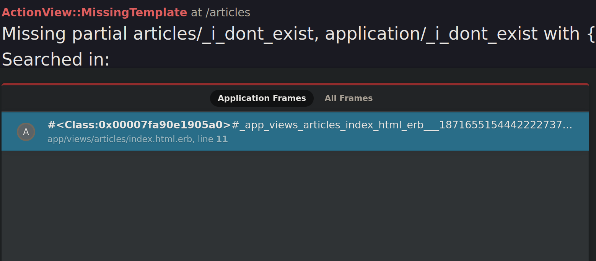
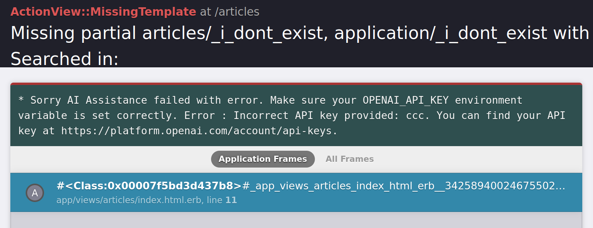
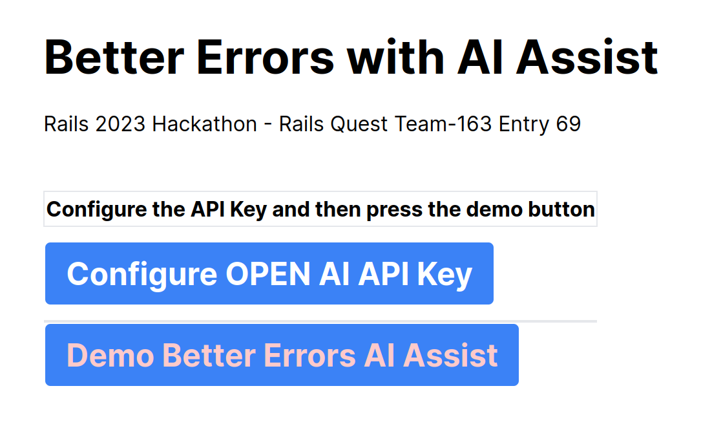

# DEMO AI assist better_errors gem 

The demo uses [AI assist fork](https://github.com/rlogwood/better_errors_ai_assist) of better_errors gem

- located here https://github.com/rlogwood/better_errors_ai_assist

On the landing page you can visit a link that will generate an error invoking the BetterErrors AI assist feature.

To make the feature available, create an [Open AI API key](https://platform.openai.com/account/api-keys).

When running the demo app, you will have to enter your Open AI API key into the configuration.

AI Assist Working

AI Assist Answer

AI Assist off, no OpenAI Key defined

 

Invalid OpenAI Key

